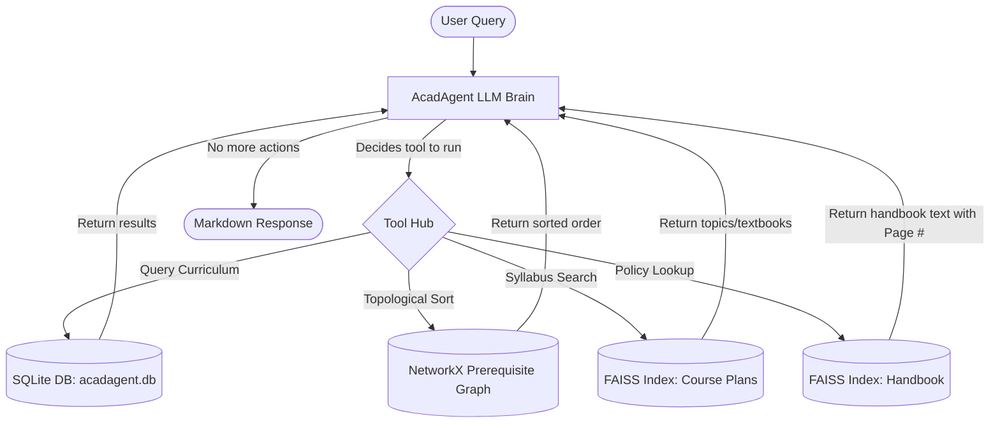

# AcadAgent 🎓
> **BTech Academic Advising Assistant — IIT Gandhinagar**

AcadAgent is an AI-powered academic planning agent designed specifically for IIT Gandhinagar undergraduate (BTech) students. It uses a structured SQLite database for timetables, a NetworkX graph for prerequisite topological sorting, and FAISS vector indexes for semantic academic policy and syllabus retrieval. Built strictly with LangGraph, SQLite, FAISS, and NetworkX.

---

## 🛠️ Architecture Workflow

The system operates as a **ReAct (Reasoning + Action) Agent** loop managed by **LangGraph**:



---

## 🌟 Key Features

* **Curriculum Pathway Generator**: Performs recursive ancestor checks on a **NetworkX directed graph** and runs a **Topological Sort** to construct the exact sequence of courses a student needs to take first (e.g. taking `ES 112` before `CS 201`, before `CS 330`).
* **Interactive Day & Time Slot Translator**: Queries class timetables from SQLite and automatically translates slots (e.g., `E1, E2, H1`) into exact days of the week and time windows (e.g., Wednesday 10:00 - 11:20 AM).
* **Timetable Conflict Checker**: Compares slots of a list of courses and flags specific clashing times within the semester.
* **Handbook Policy RAG**: Runs semantic vector retrieval over the official IITGN Academic Handbook, citing exact page numbers for minor pathways, graduation credits, and honour requirements.
* **Syllabus Retriever & LLM Fallback**: Retrieves course topics and textbook references from syllabus PDFs. If a course plan is not officially uploaded, the agent gracefully flags this and generates an academic description of the course using internal knowledge.
* **Resilient Model Fallback Chain**: To prevent free-tier `429 RESOURCE_EXHAUSTED` and `503 UNAVAILABLE` errors, the agent dynamically cycles through candidate models (`gemini-2.5-flash-lite`, `gemini-3.1-flash-lite`, `gemini-2.0-flash`, `gemini-2.5-flash`) in less than a second to ensure uninterrupted uptime.
* **Interaction Execution Logs**: Logs the exact execution trajectory of every user request (models tried, tools invoked, arguments, outputs, and final response) to `interaction_logs.txt` for study and evaluation.

---

## 📁 Project Structure

```
├── agent/
│   ├── advising_agent.py          # LangGraph agent definition & fallback loop
│   └── tools.py                   # Custom SQLite, NetworkX, and FAISS tools
├── db/
│   ├── ingest_to_sqlite.py        # Parses timetables & calculates BTech semesters
│   ├── build_vector_store.py      # Indexes the Academic Handbook PDF
│   └── build_course_plans_index.py# Authenticates with Google Drive & indexes plans
├── graph/
│   ├── build_prerequisite_graph.py# Rebuilds the NetworkX DiGraph via LLM schemas
│   └── prerequisite_graph.pkl     # Serialized NetworkX Graph pickle
├── app.py                         # Streamlit Chat Interface with theme styling
├── difficulties_faced.txt         # Study guide for technical interview prep
├── interaction_logs.txt           # Logs of query execution trajectories
└── README.md                      # Project documentation
```

---

## 🚀 Setup & Installation

### 1. Clone the repository
```bash
git clone https://github.com/AnshulKhamele/AcadAgent.git
cd AcadAgent
```

### 2. Set up Virtual Environment
```bash
python -m venv venv
# On Windows:
.\venv\Scripts\activate
# On Linux/macOS:
source venv/bin/activate
```

### 3. Install Dependencies
```bash
pip install -r requirements.txt
```
*(Dependencies include: `streamlit`, `langchain-google-genai`, `langgraph`, `networkx`, `faiss-cpu`, `openpyxl`, `python-dotenv`, `matplotlib`).*

### 4. Configure Environment Variables
Create a `.env` file in the project root:
```env
GOOGLE_API_KEY=your_gemini_api_key_here
GOOGLE_DRIVE_API_KEY=your_google_drive_api_key_here
```

### 5. Build the Databases and Graph Indexes
Run the following scripts sequentially to process the timetables, build the prerequisite graph, and index the PDFs:
```bash
python db/ingest_to_sqlite.py
python db/build_vector_store.py
python db/build_course_plans_index.py
python graph/build_prerequisite_graph.py
```

### 6. Run the App
Launch the Streamlit interface:
```bash
streamlit run app.py
```
Open `http://localhost:8501` in your browser.

---

## 📊 Visualizations
* **Pathways Graph**: View a plotted representation of the prerequisite connections in `cs_prerequisites.png`.
* **Agent Workflow**: View the state diagram of the LangGraph ReAct loop in `langgraph_workflow.png`.
* Detailed summaries are available in [visualizations.md](visualizations.md).
